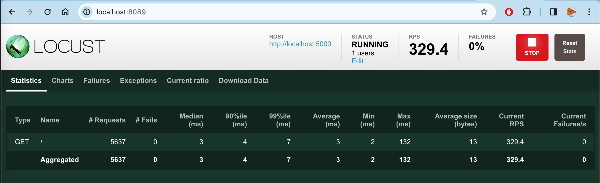
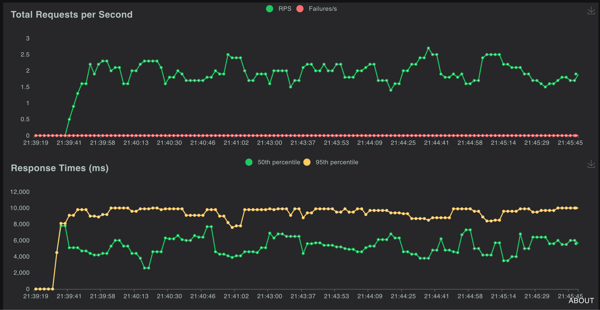

# tolle-locust

A demo project for load testing with locust

It consists of two parts:

- [app001](app001), a naive Flask app that is going to be tested
- The actual test-suite in implemented in locust

## Get started

Create a virtual environment and activate it

```bash
python3 -m venv .venv
source .venv/bin/activate
```

Install the dependencies

```bash
pip3 install -r requirements.txt
```

## Run the web app

In Terminal run this if you use Linux or adjust the commands according the [Flask quickstart](https://flask.palletsprojects.com/en/2.0.x/quickstart/)

```bash
cd app001
export FLASK_APP=hello
flask run
```

Go to `localhost:5000` in your browser and see that it works.

## Run the tests

While the Flask app is still running, open a new shell tab, activate the virtual environment and run the test:

```bash
source .venv/bin/activate
locust --host http://localhost:5000
```

If you want to dig deeper into how `locustfile.py` is built, check the [locust documentation](https://docs.locust.io/en/stable/quickstart.html)

Go to `localhost:8089` in your browser and start testing.



You can also start a headless test:

```bash
locust --host http://localhost:5000 --headless --users 10 --spawn-rate 0.5 --run-time 1m
```

## Testing Heavier Load

Next, let's try it with a heavier load. This will use another endpoint that randomly waits from 1ms to 10s.

```bash
locust --locustfile locustfile-heavier.py --modern-ui --host http://localhost:5000 --users 10 --spawn-rate 1
```

You can check the


What is the limit?

With 1000 users and 100 RPS it still works.

```bash
locust --locustfile locustfile-heavier.py --modern-ui --host http://localhost:5000 --users 1000 --spawn-rate 100
```
